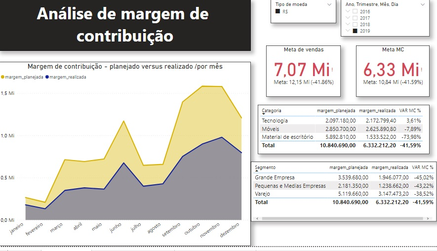
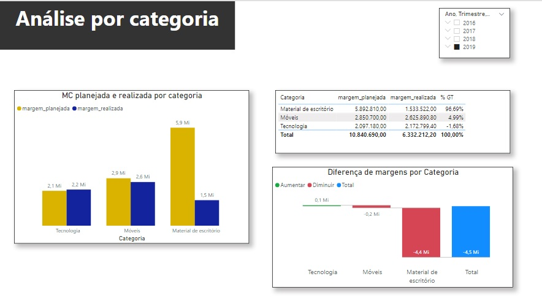

# Projeto - Margem de Contribuição

  Uma empresa é composta de custos/despesas variáveis e fixas, sendo as variáveis aquelas diretamente relacionadas com a atividade principal da empresa. Por exemplo, se um estabelecimento produz embalagens para venda, seus custos variáveis, como matéria-prima e mão-de-obra, vão aumentar à medida que a produção também aumenta. A partir disso, chega-se ao conceito de margem de contribuição, que corresponde à parcela do preço de venda que supera os custos e despesas variáveis e que contribuirá para o pagamento dos custos fixos e, consequentemente, para a formação de lucro.
  
  É fundamental que a empresa projete, com base em dados passados, a sua margem de contribuição futura para alimentar o processo de tomada de decisão. Posteriormente, comparar suas previsões com o que foi efetivamente realizado para verificar se o modelo utilizado para o cálculo das receitas e despesas está acurado ou não. O seguinte projeto tem por objetivo justamente analisar se o modelo da empresa atingiu seus objetivos. Para isso, pode-se fazer algumas perguntas:
  
* A vendas previstas foram realizadas?
* As margens de contribuição previstas foram realizadas?
* Qual o produto que mais adiciona valor à receita da empresa?
* Qual o segmento que mais adiciona valor à receita da empresa?
* É necessário realizar algum ajuste na previsão do modelo?

  As análises foram feitas pelo Power BI. O primeiro deixa fornece uma análise geral dos dados.
  

  
  No gráfico ''Margem de contribuição - planejado versus realizado'', verifica-se na área amarela que houve uma sobrevalorização da margem de contribuição planejada ao longo de janeiro a dezembro de 2019, com destaque para o período entre setembro e dezembro. O esperado era vender R$12,15 milhões e uma margem de contribuição de R$ 10,84 milhões, porém, foi realizado R$ 7,07 milhões e R$ 6,33 milhões de receita e margem de contribuição, respectivamente. Ou seja, a empresa recebeu aproxidamente 42% a menos do que a previsão tinha mostrado. 
  
  A partir da tabela de categoria, observa-se que a de material de escritório possui a maior margem planejada, com R$ 5,89 milhões, seguida pela de móveis com R$ 2,85 milhões e de tecnologia, com R$ 2,09 milhões. Contudo, quando observa-se a margem realizada, a categoria que mais contribuiu foi a de móveis, com R$ 2,62 milhões, depois a de tecnologia com R$ 2,17 milhões e, por último, a de material de escritório com apenas R$ 1,53 milhões.
  
  A partir da tabela de segmento, verifica-se que o de varejo possui a maior margem planejada, com R$ 5,11 milhões, seguido pelo de grandes empresas com R$ 3,53 milhões e de pequenas e médias empresas, com R$ 2,18 milhões. Na margem realizada, os segmentos mantém a mesma ordem de importância, porém, com valores diferentes: R$ 3,14 milhões para varejo, R$ 1,94 milhões para grandes empresas e R$ 1,23 milhões para pequenas e médias empresas.
  
  O segundo dashboard é focado na variável categoria.
  
  
  
  Pode-se notar a maior discrepância se encontra na categoria materiais de escritório. Enquanto a de tecnologia superou as expectativas em 3,61% e a de móveis frustou em apenas 7,89%, a categoria de materais de escritório teve uma margem de contribuição 73,98% menor do que o planejado, o que impactou significativamente a margem de contribuição total visto que era a categoria onde a empresa apostava faturar mais.
  
  O modelo de predição de receita foi bastante assertivo nas outras categorias, entretanto, sobrevalorizou a categoria materiais de escritório, o que gerou uma distorção nos resultados finais. A revisão do modelo se faz necessária para verificar quais variáveis estão inflando as receitas de uma só categoria.
  
  
   
